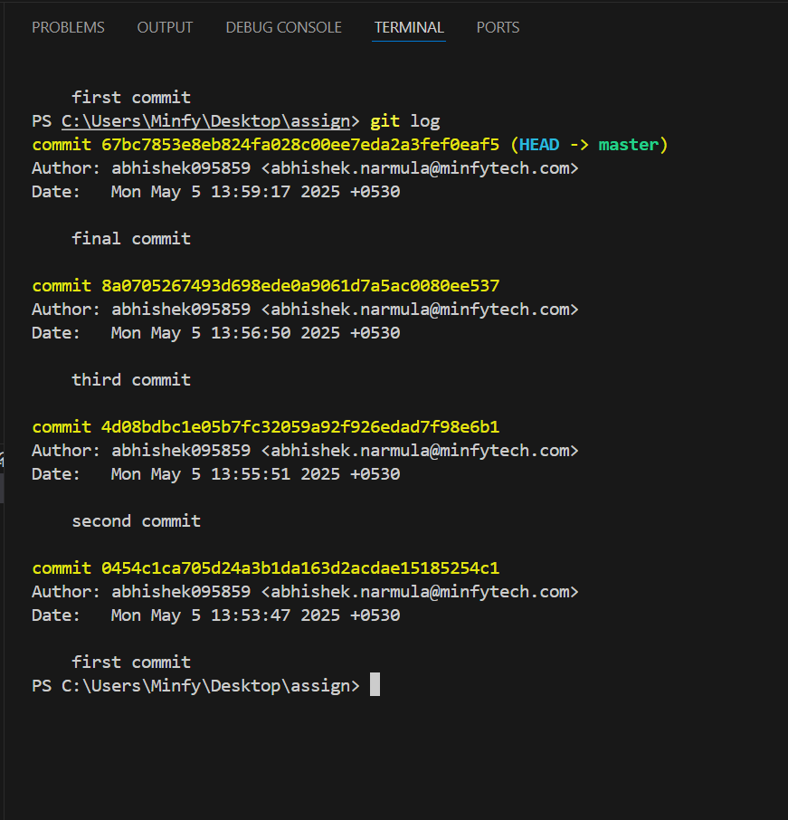

# Title : Assignment 1 

This is about the basics of git commit history

# Repository with commit history
1. Inital the git with git init command
2. add the files "git add ."
3. commit the files "git commit -m "first commit"

### Then makes changes or add a new line in the existing file upto separate  3 lines 
1. After changes or adding new line we need to
2. add the file "git add ."
3. Then commit again the file "git commit -m "second commit"

4. Then add new line again 
5. Add the file "git add ."
6. then commit "git commit -m "third commit"

7. then add the last line in the file 
8. add the file "git add ."
9. commit it "git commit -m "final commit"

## git log command to view the history of commits 
git log 

## git diff command to examine difference between versions of files 
git diff 

